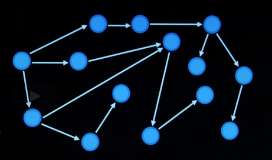
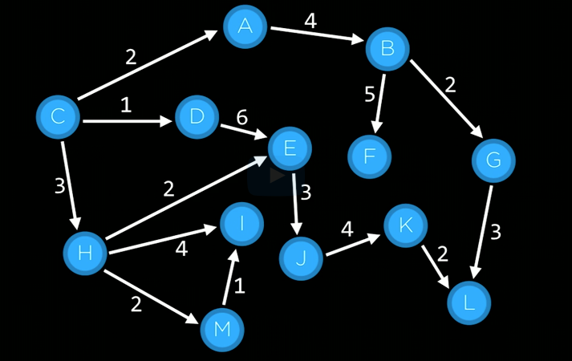

# Terminologies

## agent
- e.g. 
  - car in google maps
  - person playing the game in 15 puzzle or tic-tac-toe

## state
- configuration
- e.g. configuration of tiles in 15 puzzle

## intial state
- state where agent begins

## actions
- choices that can be made in any given state
- function : actions(s)
  - s : state
  - returns : set of actions valid in the given state 's'
- e.g. in the 15 puzzle game moving tiles -> or <- or up or down

## transition model
- description of what state results from performing any applicable action in any state.
- function : result(s,a)
  - s : state
  - a : action
  - returns : the state we get after performing action 'a' in state 's'

## state space
- the set of all the states we can get from the initial state by any sequence of actions
- 

## goal test
- way to determine whether a given state is a goal state
- e.g. in 15 puzzle, numbers in ascending order or in google maps, state = destination entered by the user.
- some problems may have one goal
- complex problems may have multiple goal states, multiple ways to solve a problem. we may not care which one the AI find as long as it does find.

## path cost
- numerical cost associated with a given path
- 
- will only apply for some problems
- does not apply to 15 puzzle since the cost is the same to move the tile

## solution
- sequence of actions that will take us to the goal state from the 

## optimal solution
- lowest path cost among solutions
