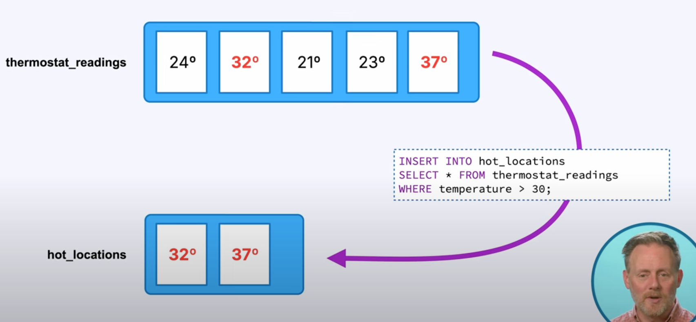

# Apache Kafka 101
## Intro 
### Things vs Events
- Kafka emphasizes capturing events, actions like user clicks or sales in real time, rather than just representing 
static tables of data
### Real Time Processing & Storage
- Kafka processes events immediately as they occur but also retains them for later use, enabling both real-time 
computation and historical data access

## Topics
- Topics are where messages are stored
- Messages are immutable. Cannot be changed. Can be deleted though.
- Having just one topic is like having one table in a db, You could have 1000s
- Internally Kafka does not care about the data format. 
- Data formats used
  - JSON
  - Avro
  - Protocol buffers
- Derive topics from other topics
- 
- Kafka topics are logs not queues.
- 
